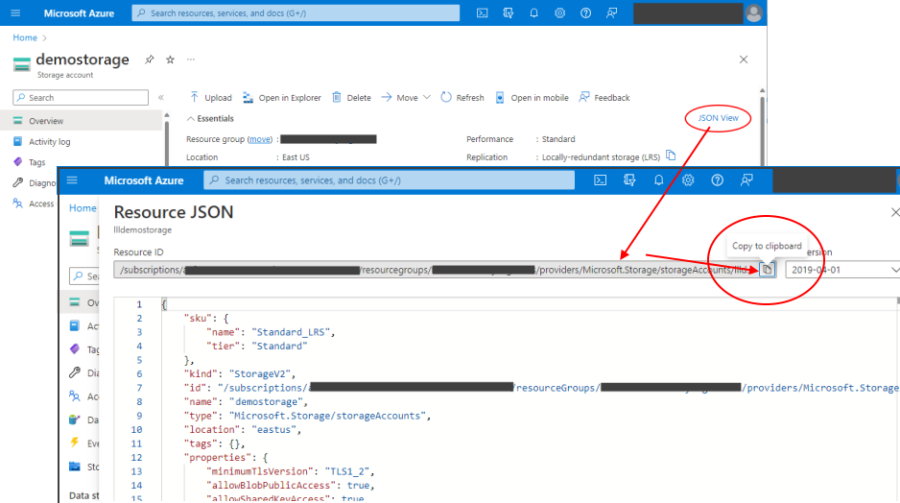
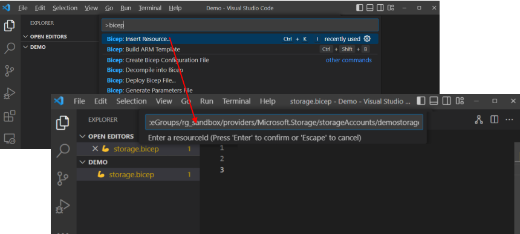
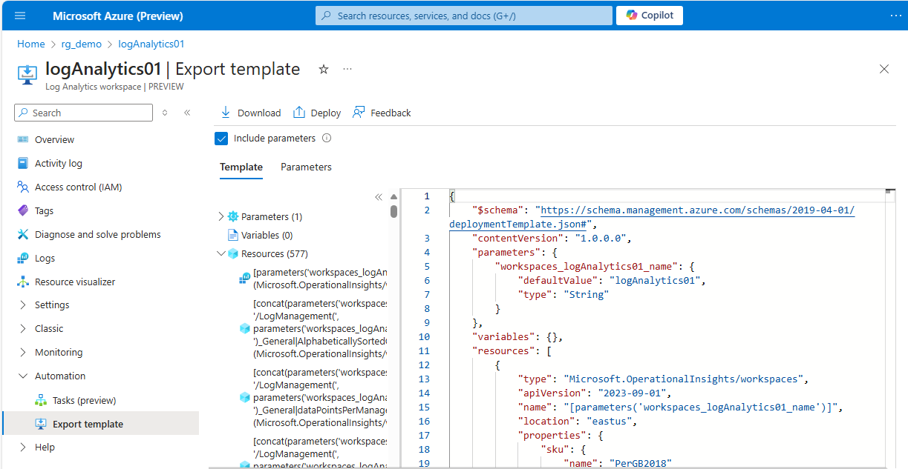
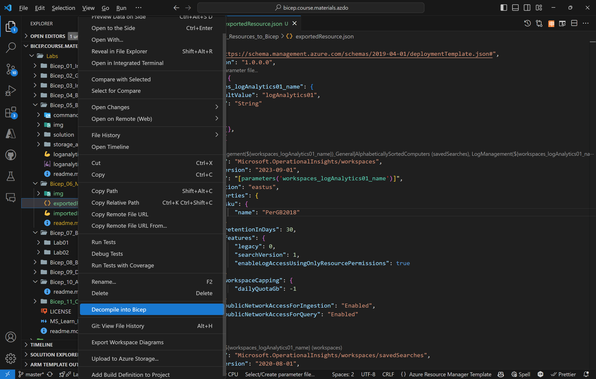

# Bicep Lab 5: Migrate Azure Resources and ARM templates to Bicep

## Creating Bicep Files

There are several ways to migrate existing Azure resources and ARM templates to Bicep. In this module, you will learn how to migrate existing Azure resources and ARM templates to Bicep.

There are several ways that you can create Bicep files:

- Create them by hand (with a little help from Copilot this is doable, but only as a last resort…)
- Copy from someone else (the developer’s favorite method!)
- VS Code Import
- Reverse Engineer ARM files
- Use a Bicep Container Registry (private or public)

The first two are pretty obvious, so I won’t say any more about them, and the Bicep Container Registry will be covered in a future lab.

---

## VS Code Import Resources

This is a great way to start if you have a resource in Azure but do not have a Bicep or ARM file for that resource – all you need is your full Resource Id. The quickest way find that is to pop over to the Azure Portal and navigate to the resource in question. Click on the “JSON View” link in the upper right corner, then use the Copy button to copy the full Resource ID to your clipboard.



Once you have that, return to VS Code, popup the command pallette and select the “Bicep: Insert Resource…” command and paste your Resource Id:



And it’s as easy as that – quick as a whistle, you have your Bicep file…!

> Note: You should notice that this Bicep file is MUCH larger than the one you created by hand. This is because it includes all the properties for the resource, not just the ones that were required to create the resource. All of those values were created using defaults. You can remove any of the properties that you don’t need, but you should be careful to not remove any that are required for the resource to be created.

---

## Exporting JSON Templates in Azure

You can also go into the Azure Portal and export a resource template for an existing resource by going to the resource, then down to the Automate -> Export Template menu item. This will give you a JSON template that you can then convert to Bicep.



You can use the download link on this page, or just copy/paste the JSON for use in VS Code. Go ahead and copy this code and we will use it in the next section.

Create a new file in VS Code and paste the JSON into it and save it as exportedResource.json.

---

## Converting ARM JSON Templates in VS Code

You have multiple options in VS Code to convert ARM JSON templates to Bicep - give each of them a try so you know what each can do.

- Right-Click on the file and use the menu item `Decompile into Bicep` to convert it to Bicep.  



- Open the file in VS Code and use the Command Palette menu item "Bicep: Decompile into Bicep" to do the same thing.


- Anywhere in any folder where you have a JSON ARM template, you can use the `az bicep decompile` command line command to convert it to Bicep

Open a terminal, navigate to the folder where you saved the JSON file and then run this command:

```bash
az bicep decompile -f exportedResource.json
```

- Copy the JSON to the clipboard and **create and save** a open a blank file named `converted.bicep`, then paste it into the VS Code editor.  The editor should recognize that this is valid ARM JSON and since your file extension is .bicep, it will convert it to Bicep for you auto-magically.

---

## Make some changes

Go ahead and make a small change like changing the name parameter default, then deploy a new resource based on your imported resource definition back to Azure:

``` bash
$resourceGroupName="rg-lod"
az deployment group create `
 --resource-group $resourceGroupName `
 --template-file exportedResource.bicep
```

---

## Yet Another Lab Guide

If you want to explore more on this with VMs and VNETs, you can follow these lab guides:

- [MS Learn - Intermediate Bicep Exercise - Convert and migrate resources](https://learn.microsoft.com/en-us/training/modules/migrate-azure-resources-bicep/3-exercise-convert-migrate-resources)

- [MS Learn - Intermediate Bicep Exercise - Test and deploy your converted template](https://learn.microsoft.com/en-us/training/modules/migrate-azure-resources-bicep/7-exercise-test-deploy-converted-template)

<!-- ------------------------------------------------------------------------------------------ -->
---

This completes this lab.

[Next Lab](../06_Modules/readme.md) | [Previous Lab](../04_Conditions_and_Loops/readme.md) | [Table of Contents](./readme.md)
