# Bicep Lab 7 - Deploying via a YML Pipeline

In this lab we are now going to take a deeper look into one of the powerful features of YML-based pipelines in Azure DevOps - we are going to use a YML Template to deploy a Bicep resource. In this lab, the template has been provided for us, so all you have to focus on is how to use it.

---

## Exercise 1: Load Steps from a Templates

First we will create a new pipeline in Azure DevOps.

* Goto Pipelines -> Pipelines
* Click `New pipeline`
* Select `Azure Repos Git (YAML)`
* Select the `activate.bicep.course` repository
* Click `Starter pipeline`

This will create a new `Starter pipeline` in our repository.

Let's give our new pipeline a name that is a bit better than the default azure-pipelines-1-yml.

* Click on the filename at the top of the page and change the name to `deploy-bicep.yml`.

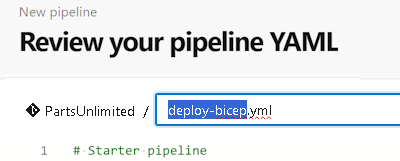

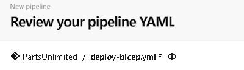

Now that we have created a new pipeline and renamed the file successfully, let's put in some code to reference a template that contains our deployment tasks by deleting  all of the existing code and replacing it with the following:

```yml
# Pipeline to deploy a bicep file using a template
trigger: none
pool:
  name: default
variables:
- template: ./.azdo/pipelines/vars/var-service-connections.yml
stages:
- stage: BicepDeploy  
  jobs:
  - template: ./.azdo/pipelines/templates/deploy-bicep-template.yml
    parameters:
      templateFileName: 'main-simple.bicep'
      parameterFileName: 'main-simple.bicepparam'
```

A couple of points to note about this code:

* the new trigger will modify the behavior so that it only runs on demand during our labs, not every time any file changes in the main branch
* the default pool will use the user defined agent that we created in the previous lab
* the `template` line assumes that you are creating this in the root directory of the repository, and the template exists in the `.azdo/pipelines/templates` folder

Your new pipeline should now look like this:

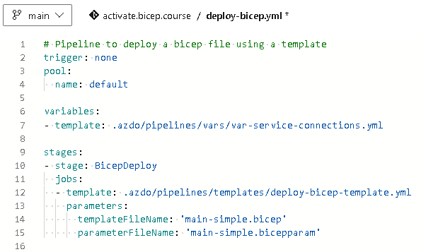

Save this into the main branch and run the pipeline:

* Click `Save and run`
* Select `Commit directly to the master branch`
* Click `Save and run`

> Note: To get this pipeline to run on the Lab VM successfully, you must have created a self hosted agent on the VM and have it running.  If you have not done that, go back and perform `Module 4: Azure Pipelines` -> `Lab 1: Configuring CI/CD Pipelines` -> `Task 3: Configuring a self-hosted agent`.  Once that is configured, if it's not already running, return to the `c:\agent` folder on the command line and execute the `.\run.cmd` command to start the agent.

## Exercise 2: View the Pipeline Results

When it runs, the template will contain one one stage with one job --> deploy this one bicep file. Let's now go there and check the logs:

* Goto Pipelines -> Pipelines
* Select our new pipeline

Before we continue, let's rename the pipeline first:

* Click on the button with the three dots

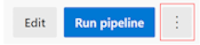

* Select `Rename/move`
* Call it `<yourName> Basic Pipeline with Template`

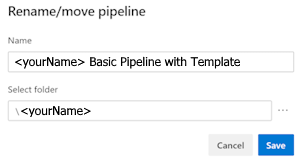

* Click `Save`

Our pipeline was now renamed and is now easier to find.

* Select the last run
* Select the job `Job`

You should see the steps that are coming from our template, but also a warning that some permissions are missing. The first time we run a pipeline, we need to give it permission to access the resources that it needs. In this case, we need to give it permission to access the service connection that we created in the previous lab, and the environment, and the agent pool.

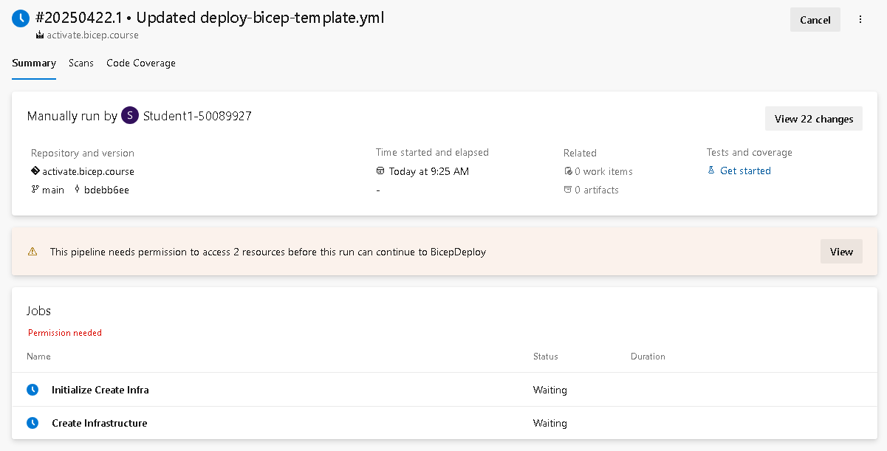

Click on the `View` button and grant rights to these resources.

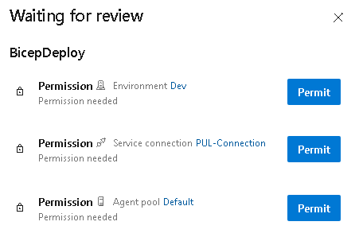

Once you have granted the permissions, you can now see the steps start to run.  If you click on the blue `Create Infrastructure` link, you will see the output of the bicep deployment.

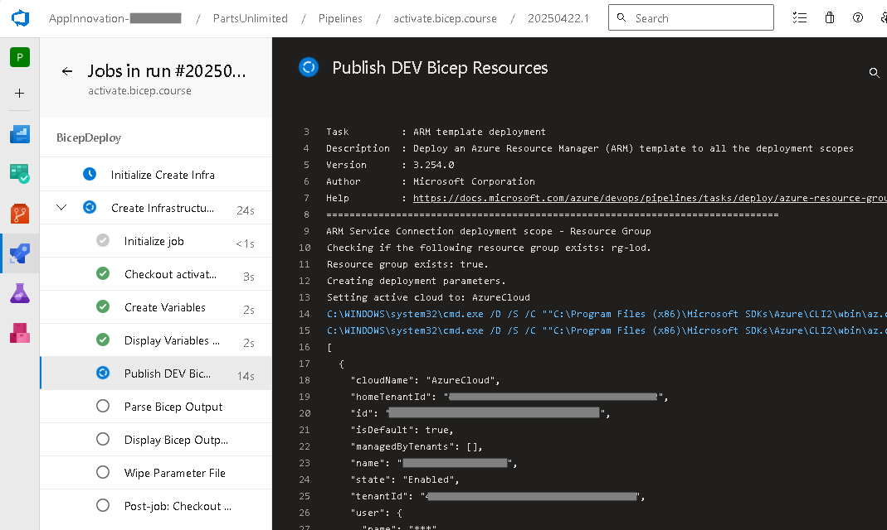

You can see the output of the bicep deployment in the logs and watch as each step completes.  Once the steps are done, if there are any errors, you can view the log information here to plan your next steps.

Hopefully you will see a success message at the end of the deployment and all of the icons have turned green on the pipeline page indicating a successful run!

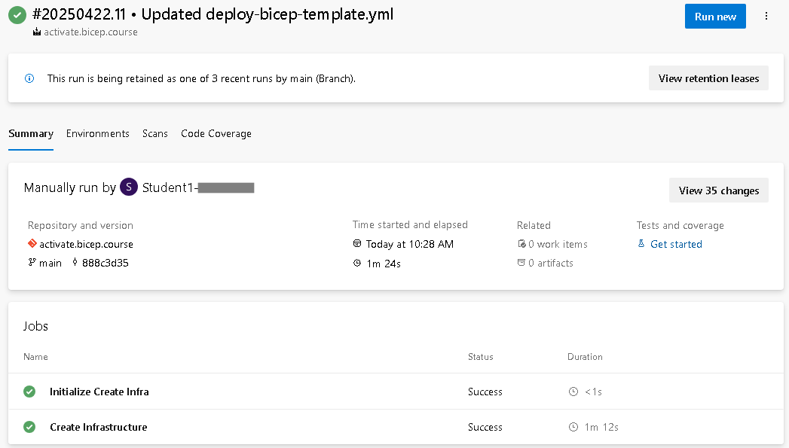

## Exercise 3: Add a Scan Code Template

Next we will add another job to scan the code for security vulnerabilities and other issues. Return to the pipeline editor and add these lines at the bottom of your pipeline.  Make sure the indentation is correct and the `- stage:` lines up with the previous stage, or your pipeline will fail to run successfully.

```yml

``` yml
- stage: BicepDeploy  
  jobs:
  - template: .azdo/pipelines/templates/scan-code-template.yml
```

Once you save the changes and run this job, you will see that the pipeline now has two stages. The first stage is the deployment of the bicep file, and the second stage is the scan code job.

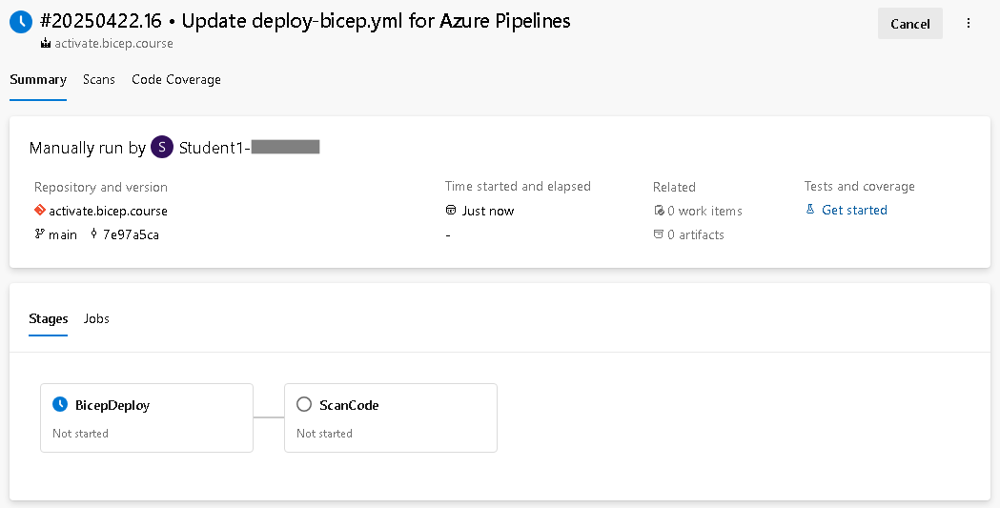

Once the pipeline has run, you can see the results of the scan code job.  This job will scan the code for security vulnerabilities and other issues.  Click on the `Scans` tab to see the results of the scans. There should be several warnings found in this repository as this code is not hardened for production use.

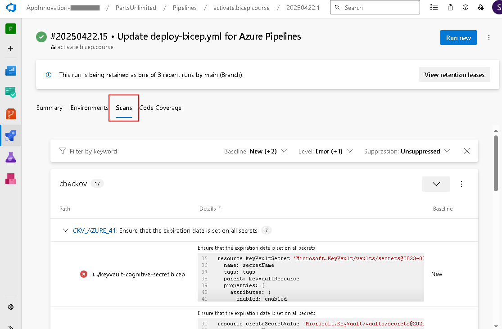

---

There is much more to learn about pipelines, but this lab should give you a good start on how to use a YML template to deploy Bicep in a pipeline.

This completes this lab.

[Next Lab](../08_Tips/readme.md) | [Previous Lab](../06_Modules/readme.md) | [Table of Contents](../readme.md#bicep-labs)
