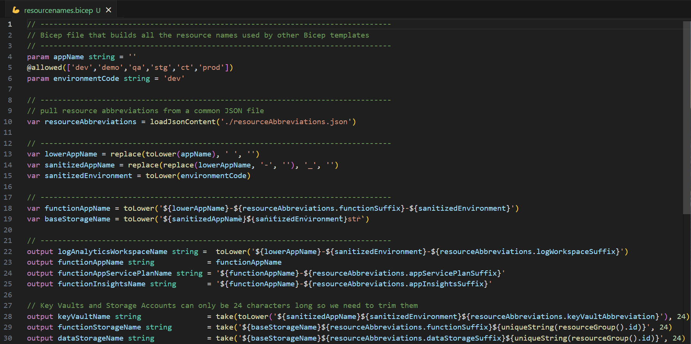
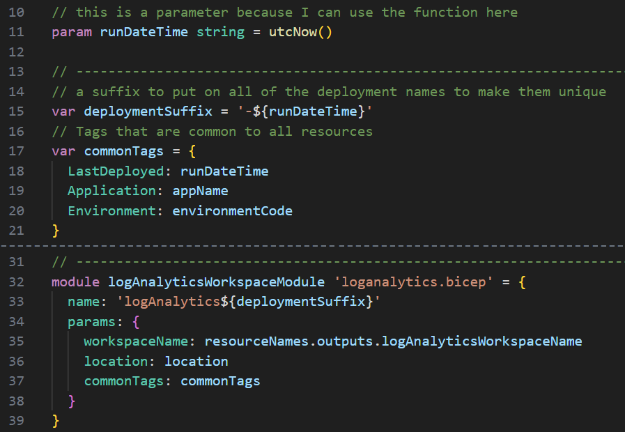
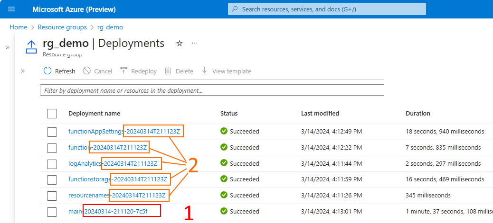

# Lab 8 - Advanced Bicep Tips and Tricks

## 1. Use a resource names file

The [resourcenames.bicep](resourcenames.bicep) file is a technique to put all of the object naming standards in one file. This is the first module that I usually call in each of my `main.bicep` files. Having all the names in this one place gives one an easy way to change things later if needed, without affecting all the other files.

The main inputs to this module are usually some form of the application Name and the environment, which are then used to create a unique name for all the main resources.

These inputs get scrubbed to keep them consistent (lines 13-15), then combined into a more complex multi-part base names (lines 18-19), and then those variables are used to create the actual output variables to be used by other templates (lines 22-30).

Storage file names and key vault names (lines 28-30) need some special attention as they can have length limit, must be lower case and don’t allow some characters, so this is a great place to scrub them and make sure a long `appName` doesn’t break the storage file size limits.



> Note: This resourcenames.bicep will most likely be unique to each project and so it is not a good candidate to store in a Bicep Container Registry.

---

## 2. Loading data from a JSON file

If you look at line 10 if the previous example you will see this interesting nugget:


The loadJsonContent function allows us to read in an object from JSON and create an object that can be references easily, as seen in line 18 where we abstract the comment suffix for functions.  This allows us to follow the DRY (Do Not Repeat Yourself!) principle and keep the code clean and easy to maintain, and have the naming standard for functions defined in one place.


---

## 3. Tagging items with common info

Another common pattern is to tag all resources with common information.  This can be done in the `main.bicep` file as well.  In this example, we are adding the `appName` and `environment` and a `LastDeployed` datetime stamp to all resources.  We pass the commonTags object into the resource module as a parameter, and then use the `tags` property to add the tags to the resource.



This is how it's passed into a module in line 5, manipulated in lines 7-8 to add some module specific tags, then assigned to the new resource in line 13:


---

## 3. Customizing the Deployment Name

On line 11, we are using the utcNow() function to default the value of a parameter, then creating a string in line 15 that is used as the suffix for the names of the deployments.  This is a pattern to make sure that each deployment has a unique name, and can be easily identified in the portal.


When this main.bicep runs, it will create deployments with unique names. The main.bicep file is the entry point for the deployment, and it automatically gets a name with a datetime stamp and a unique identifier, as shown in number 1.  The other modules each get a name with the runDateTime stamp appended to it, as shown in number 2, so they will be retained in the portal for a while.



---

## 4. Using "existing" resources in a pipeline

There are times when you want to retrieve the resource definition for a given resource and use that in a pipeline. For example, if you want retrieve an access key for an existing resource and put it into a key vault, you can do so easily as shown in the following example in line 18, and in the `keyvaultsecretstorageconnection.bicep` file.  Once you get a connection string built in memory you can insert it into a key vault as shown in the key vault and the secret is not passed or exposed to any other process.


---

## 6. UDF & UDT - User Defined Functions and User Defined Types

Within your Bicep file, you can create your own functions (with some restrictions), which are available for use in your Bicep files. User-defined functions are separate from the standard Bicep functions that are automatically available. Create your own functions when you have complicated expressions that are used repeatedly in your Bicep files.

Define the function:

``` bicep
func formatStorageConnectString(storageAccountName string, keyList array) string => 'DefaultEndpointsProtocol=https;AccountName=${storageAccountName};EndpointSuffix=${environment().suffixes.storage};AccountKey=${keyList[0].value}'

```

Import the function (if it's defined in a separate file...), and then call it with parameters:

``` bicep
import * as udf from './userDefinedFunctions.bicep'
var storageAccountConnectionString = udf.formatStorageConnectString(storageAccountResource.name, storageAccountResource.listKeys().keys)

```

More info can be found here:
[User Defined Functions (Microsoft Learn)](https://learn.microsoft.com/en-us/azure/azure-resource-manager/bicep/user-defined-functions)

In addition to functions, you can also define custom data types to structure variables in a way that makes sense for your project. This can be useful when you have a complex object that is used in multiple places in your Bicep files.

For more info, see [User Defined Data Types (Microsoft Learn)](https://learn.microsoft.com/en-us/azure/azure-resource-manager/bicep/user-defined-data-types)

---

All of these resources are in this folder.  Feel free to explore them and to deploy the main.bicep file to see how they all work together.

``` bash
$resourceGroupName="rg-lod"
az deployment group create `
 --name bicep.tips.01 `
 --resource-group $resourceGroupName `
 --template-file main.bicep

```

---

This completes this lab.

[Next Lab](../09_Bicep_Registries/readme.md) | [Previous Lab](../07_YML_Pipeline_Deploy/readme.md) | [Table of Contents](../readme.md#bicep-labs)
