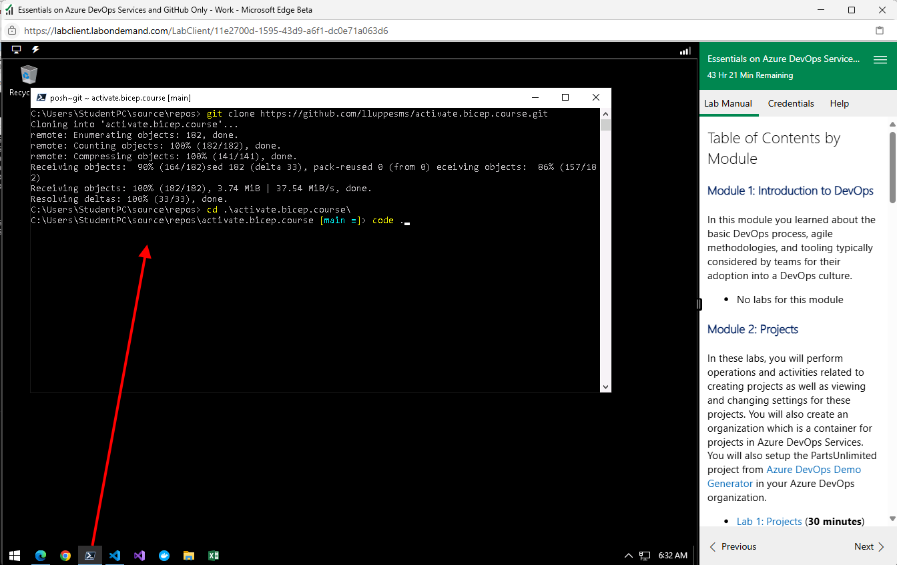
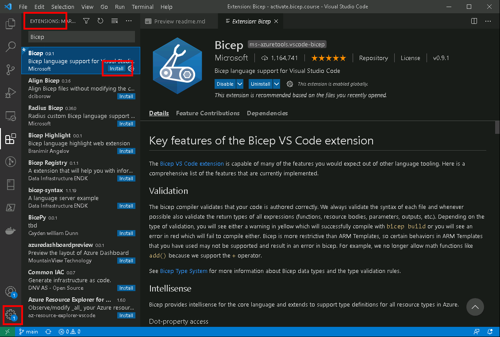

# Bicep Course Labs

## Microsoft Learn - Learning Path

If you want to run through the official Learning Path from Microsoft Learn, labs and information can be found here: [Infrastructure as Code with Bicep - Microsoft Learn](MS_Learn_Intro_To_Bicep_Labs.md)

## Prerequisites

* If you have not created an Organization and a Project in Azure DevOps, please start with the preparation tasks in Module 2: Project, Lab 1.

* If you need a custom Build Agent and have not created one yet, you can install a Build Agent on your VM or your Local Machine.  Please follow the instructions in Module 4, Lab 1, Task 3.

---

## Clone the repository to your lab VM

Open a PowerShell terminal and run the following commands to clone the repository to your local machine and open VS Code.

```powershell
cd C:\Users\StudentPC\source\repos
git clone https://github.com/lluppesms/activate.bicep.course.git
cd .\activate.bicep.course\
code .
```

It should look like this:



## Before You Start

* You should have an Azure DevOps Project set up
  * see Module 2: Project, Lab 1
* You should have a Self Hosted Agent installed on the Lab VM if you want to run YML pipelines
  * see Module 4, Lab 1, Task 3
* Make sure your Lab VM's VS Code has the Bicep extension installed. Click on the `Manage` icon in the left-hand menu, and then click on `Extensions`. Search for `Bicep` and install it if it is not already installed.


---

## Bicep Labs

This workshop will cover a series of labs, in which you will learn to create effective Bicep Templates.

### Introduction To Bicep

* [Lab 2 - Introduction to Bicep](./02_Intro/readme.md)
* [Lab 3 - Using Bicep Parameters](./03_Parameters/readme.md)
* [Lab 4 - Using conditions and loops in a Bicep Template](./04_Conditions_and_Loops/readme.md)

### Migrating to Bicep

* [Lab 5 - Migrate Azure Resources and ARM templates to Bicep](./05_Migrate_to_Bicep/Lab01/readme.md)

### Reusable Bicep

* [Lab 6 - Using Local and Public Modules in a Bicep Template](./06_Modules/readme.md)
* [Lab 7 - Creating Private Bicep Registries](./07_Bicep_Registries/readme.md)

### Advanced Bicep

* [Lab 8 - Deploy Resources to Multiple Scopes](./Bicep_9_Deploy_Resource_Targets/readme.md)
* [Lab 9 - Tips and Tricks](./Bicep_10_Advanced_Bicep_Tips/readme.md)

<!-- * [Lab 99 - Publish Reusable Code with Template Specs](./archives/99_Bicep_Template_Specs/readme.md) -->
<!-- * [Lab 98 - CICD Pipelines](./archives/98_CICD_Pipelines/readme.md) -->

---

[Table of Contents](../../readme.md)
